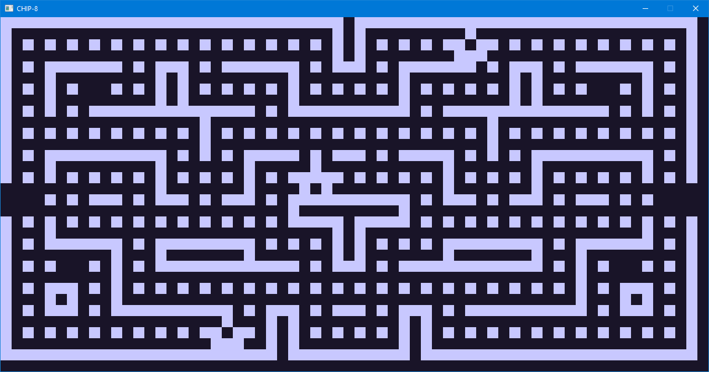

# CHIP-8 Emulator

A CHIP-8 emulator written in Rust in ~1000 lines.

If you're interested in writing video game console emulators have a look at the article below. I explain how emulators work and how to approach writing them:

[How to write a game console emulator](https://wjdevschool.com/blog/video-game-console-emulator/)

## File Structure

| File               | Description             |
| ------------------ | ----------------------- |
| `src/chip8.rs`     | Emulator interface      |
| `src/chip8/clk.rs` | Clock                   |
| `src/chip8/cpu.rs` | CPU                     |
| `src/chip8/dsp.rs` | Display                 |
| `src/chip8/kbd.rs` | Keyboard                |
| `src/chip8/mem.rs` | Memory                  |
| `src/chip8/op.rs`  | Instruction decoding    |
| `src/chip8/rng.rs` | Random number generator |
| `src/chip8/set.rs` | Settings                |
| `src/main.rs`      | Program entry point     |
| `src/platform.rs`  | Platform layer          |

## Configuration

The emulator is not a complete end-user application. ROM path and emulator configuration has to be changed inside the source code in:

| File               | Settings                                              |
| ------------------ | ----------------------------------------------------- |
| `src/main.rs`      | ROM path                                              |
| `src/platform.rs`  | Keymap                                                |
| `src/chip8/set.rs` | Emulator settings (preferences and ROM compatibility) |

See the ROM compatibility list below for settings for particular ROMs.

## ROM Compatibility

Tested briefly:

| ROM      | Notes                                 |
| -------- | ------------------------------------- |
| 15PUZZLE | 100% working                          |
| BLINKY   | 100% working; needs shift quirk on    |
| BLITZ    | 100% working; needs vertical wrap off |
| BRIX     | 100% working                          |
| CONNECT4 | 100% working                          |
| GUESS    | 100% working                          |
| HIDDEN   | 100% working                          |
| INVADERS | 100% working; needs shift quirk on    |
| KALEID   | 100% working                          |
| MAZE     | 100% working                          |
| MERLIN   | 100% working                          |
| MISSLE   | 100% working                          |
| PONG     | 100% working                          |
| PONG2    | 100% working                          |
| PUZZLE   | 100% working                          |
| SYZYGY   | 100% working                          |
| TANK     | 100% working                          |
| TETRIS   | 100% working                          |
| TICTAC   | 100% working                          |
| UFO      | 100% working                          |
| VBRIX    | 100% working                          |
| VERS     | 100% working                          |
| WIPEOFF  | 100% working                          |

## Resources

Things used to write this emulator:

* [Cowgod's CHIP-8 Technical Reference](http://devernay.free.fr/hacks/chip8/C8TECH10.HTM#Bnnn)
* [Mastering CHIP-8](http://mattmik.com/files/chip8/mastering/chip8.html)
* [Kiwi-8 Emulator](https://github.com/tomdaley92/kiwi-8)
* [Public Domain ROMs](https://www.zophar.net/pdroms/chip8.html)